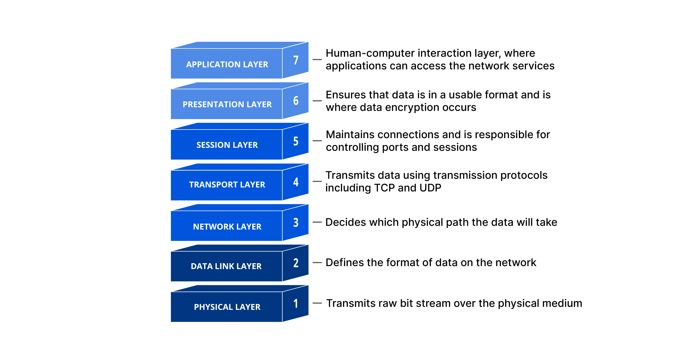
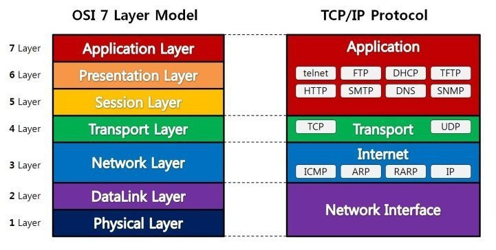
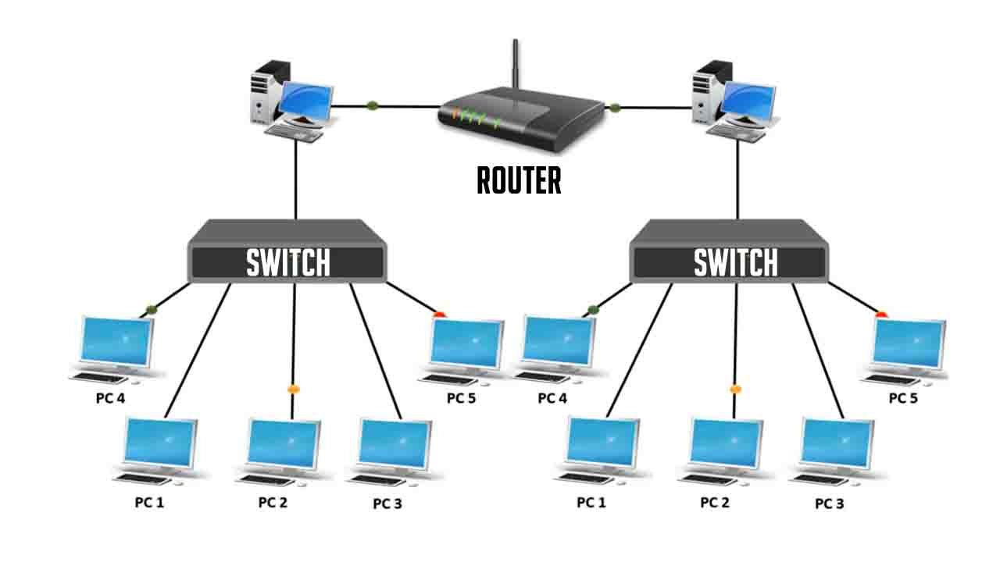
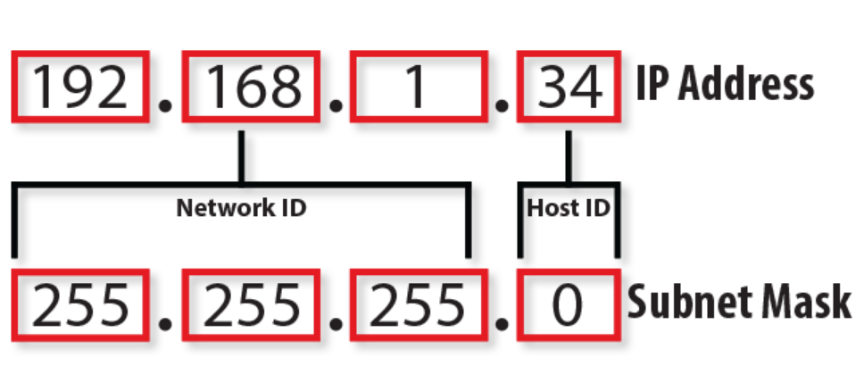

### Description
---
Net_Practice is a general practical exercise to discover networking.

### Network Architecture
---
There are two major network architecture
#### OSI Model

In the OSI (Open System Interconnection) reference model, the communications between systems are split into seven different abstraction layers: Physical, Data Link, Network, Transport, Session, Presentation, and Application
- The physical layer is responsible for the transmission and reception of unstructed raw data between a device, such as a NIC, Ethernet hub, or network switch, and a physical transmission medium. It converts the digital bits into electrical, radio, or optical signals.
- The data link layer provides node-to-node data transfer: a link between two directly connected nodes. It detects and possibly corrects errors that may occur in the physical layer. It defines the protocol to establish and terminate a connection between two physically connected devices. It also defines the protocol for flow control between them.
- The network layer provides the functional and procedural means of transferring packets from one node to another connected in "different networks". A network is a medium to which many nodes can be connected, on which every node has an address and which permits nodes connected to it to transfer messages to other nodes connected to it by merely providing the content of a message and the address of the destination node and letting the network find the way to deliver the message to the destination node, possibly routing it through intermediate nodes.
- The transport layer provides the functional and procedural means of transferring variable-length data sequences from a source host to a destination host from one application to another across a network, while maintaining the quality-of-service functions. Transport protocols may be connection-oriented or connectionless.
- The session layer creates the setup, controls the connections, and ends the teardown, between two or more computers, which is called a "session"
- The presentation layer establishes data formatting and data translation into a format specified by the application layer during the encapsulation of outgoing messages while being passed down the protocol stack, and possibly reversed during the deencapsulation of incoming messages being passed up the protocol stack.
- The application layer is closest to the end user, which means both the OSI application layer and the user interact directly with a software application the implements a component of communication between the client and server.

#### TCP/IP Model

The Internet protocol suite, commonly known as TCP/IP, is a framework for organizing the set of communication protocols used in the internet and similar computer networks according th functional criteria. The foundational protocols in the suite are the Transmission Control Protocol(TCP), the User Datagram Protocl(UDP), and the Internet Protocl(IP). The Internet protocol suite provides end-to-end data communication specifying how data should be packetized, addressed, transmitted, routed, and received. This loosely defines a four-layer model, with the layers having names, not numbers, as follows:
- The link layer defines the networking methods within the scope of the local network link on which hosts communicate without intervening routers. This layer includes the protocols used to describe the local network topology and the interfaces needed to affect the transmission of internet layer datagrams to next-neighbor hosts.
- The internet layer exchanges datagrams across network boundaries. It provides a uniform networking interface that hides the actual topology (layout) of the underlying network connections. It is therefore also the layer that establishes internetworking. This layer defines the addressing and routing structures used for the TCP/IP protocol suite. The primary protocol in this scope is the Internet Protocol, which defines IP addresses. Its function in routing is to transport datagrams to the next host, functioning as an IP router, that has the connectivity to a network closer to the final data destination.
- The transport layer performs host-to-host communications on either the local network or remote networks separated by routers. It provides a channel for the communication needs of applications.
- The application layer is the scope within which applications, or processes, create user data and communicate this data to other applications on another or the same host.

### Packet
---
A network packet is a formatted unit of data carried by a network. A packet consists of control information and user data; the latter is also known as the payload. Control information provides data for delivering the payload (e.g., source and destination network addresses, error detection codes, or sequencing information). Typically, control information is found in packet headers and trailers.

In the 7-layer OSI model of computer networking, packet strictly refers to a protocol data unit at layer 3, the network layer. A data unit at layer 2, the data link layer, is a frame. In layer 4, the transport layer, the data units are segments and datagrams.

### Switch, Router
---

#### Switch
Switches facilitate the sharing of resources by connecting together all the devices, including computers, printers, and servers, in a small business network. Thanks to the switch, these connected devices can share information and talk to each other, regardless of where they are in a building or on a campus. Building a small business network is not possible without switches to tie devices together.

#### Router
Just as a switch connects multiple devices to create a network, a router connects multiple switches, and their respective networks, to form an even larget network. These networks may be in a single location or across multiple locations. When building a small business network, you will need one or more routers. In addition to connecting multiple networks together, the router also allows networked devices and multiple users to access the Internet.

### Sub-net
---
A subnet mask is a 32-bit number used in IPv4 that divides your IP address into network and host portions. The network portion ensures that data packets reach the right network, while the host portion identifies a specific device on that network.
Just like every address is defined by a street name and a house number, an IP address consists of a network component and a host component. IP addresses consist of 32 binary bits (4 * 8), but since they are long and complex, we use a dot decimal system. The subnet mask reflects the network portion in an IP address.
