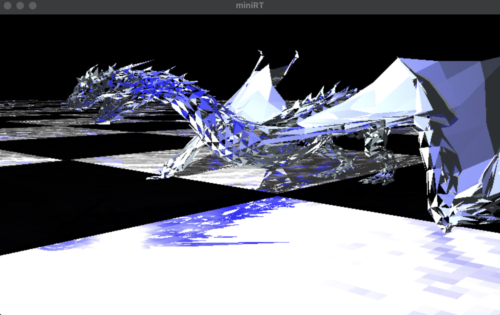
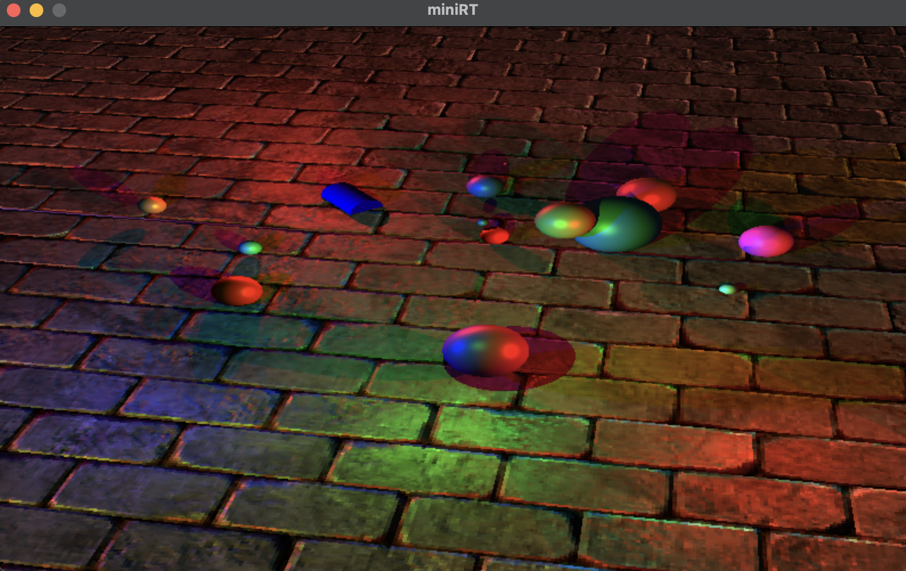
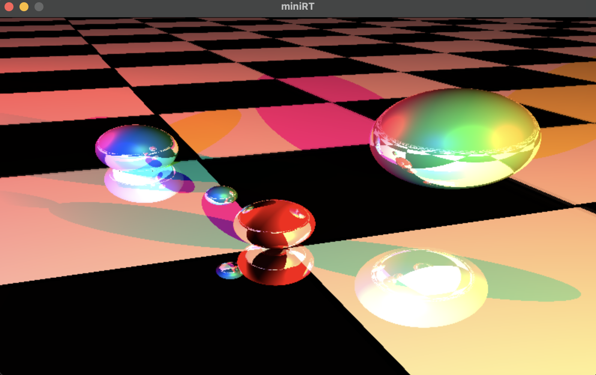

### Description
---
MiniRT is a CPU-based mini raytracer in C that utilizes a minimal graphics library.

A raytracer is a computer graphics technique used to create highly realistic images by simulating the behavior of light in a virtual 3D environment. In ray tracing, the fundamental concept revolves around tracing the path of light rays as they interact with objects and surfaces within a scene.

### Features
---
- Ambient, diffuse, and specular lighting based on Phong Lighting Model
- Multiple lights colors and intensity
- Hard shadowing
- Following primitive objects : Plane, Sphere, Cylinder, Cone, Triangle
- Multi-threaded per-pixel calculation in bonus part (frame rate increased about 5 times)
- Texture and normal mapping on xz plane
- Translatable, rotatable camera with keyboard and mouse input
- Support two Camera modes : Slow clear image, Faster fuzzy image
- Simple graphics math library named "rtmath" based on glm, supporting vec2, vec3, vec4, mat3, mat4, quaternion
- Reflection, refraction ray trace

Possible upgrades coming in a near future:
- Material systems for realistic texture
- Soft shadowing
- Anti-aliasing
- BVH or KD-tree for polygon mesh acceleration

### Controls
---
- W - Move the camera forward
- A - Move the camera left
- S - Move the camera backward
- D - Move the camera right
- 1 - Switch camera mode to realistic, slow rendering
- 2 - Switch camera mode to fuzzy, fast rendering
- Mouse movement - Adjust camera view direction
- ESC - Exit the program
